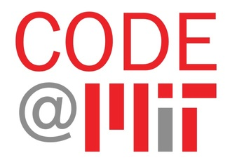

# Causal Inference Conferences

The following is a list of conferences in Causal Inference.

- [Interactive Causal Learning Conference ](http://interactivecausallearning.com/2023/)
  - **When**: 1-2 December 2023
  - **Where**: Boca Raton, US
  - **Submission Deadline**: 31 July 2023

- [Conference on Digital Experimentation (CODE) ](https://ide.mit.edu/events/2023-conference-on-digital-experimentation-mit-codemit/)
  - **Organizer**: MIT
  - **When**: 10-11 November 2023
  - **Where**: Cambridge, US
  - **Submission Deadline**: 15 September 2023
 
- [Causal Data Science Meeting (CDSM)](https://www.causalscience.org/meeting/)
  - **Organizer**: Maastricht University and Copenhagen Business School
  - **When**:  7–8 November 2023
  - **Where**: online
  - **Submission Deadline**: 1 October 2023

- [Causal AI Conference ](https://www.causalaiconference.com/)
  - **Organizer**: CausaLens
  - **When**: September 2023
  - **Where**: New York, US

- [Pacific Causal Inference Conference (PCIC)](https://sci-info.org/annual-meeting/)
  - **When**: September 2023
  - **Where**: Beijing, CN

- [Workshop on Research Design for Causal Inference](https://www.law.northwestern.edu/research-faculty/events/conferences/causalinference/)
  - **Organizer**: Northwestern University
  - **When**: August
  - **Where**: Evanston, US

- [American Causal Inference Conference (ACIC)](https://sci-info.org/annual-meeting/)
  - **Organizer**: Society for Causal Inference
  - **When**: May 2023
  - **Where**: Austin, US

- [Causality in the Sciences](https://blogs.kent.ac.uk/jonw/conferences/cits/)
  - **Organizer**: University of Kent
  - **When**: 18-20 May 2023
  - **Where**: London, UK

- [Causal Learning and Reasoning (CLeaR) ](https://www.cclear.cc/)
  - **When**: 11-14 April 2023
  - **Where**: Tubingen, Germany

- [European Causal Inference Meeting (EuroCIM)](https://www.eurocim.org/)
  - **Organizer**: University of Oslo
  - **When**: April 2023
  - **Where**: Oslo, Norway
