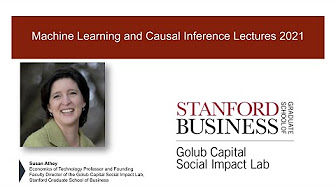
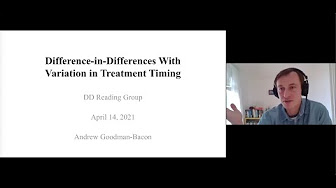
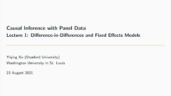

# Causal Inference Courses

The following is a list of free courses in Causal Inference, sorted by format and date.

- [Video Lectures](#video-lectures)
- [Slides](#slides)
- [Notes](#notes)

## Video Lectures

- [Causal Inference ](https://www.youtube.com/@imaikosuke/playlists)
  - **Author**: Kosuke Imai (Harvard University)
  - **Year**: 2022
  - **Lectures**: 11 x 0h:50 [[Material](https://imai.fas.harvard.edu/teaching/cause.html)]

- [Machine Learning and Causal Inference ](https://www.youtube.com/playlist?list=PLxq_lXOUlvQAoWZEqhRqHNezS30lI49G-)
  - **Author**: Susan Athey, Jann Spiess, and Stephan Wager (Stanford University)
  - **Year**: 2022
  - **Lectures**: 19 x 0h:30

- [Modern Topics in Uncertainty Quantification ](https://www.youtube.com/playlist?list=PLlIlhe_rS4U0D3jRXfwTfq3aDngb3w-hU)
  - **Author**: Aaron Roth (University of Pennsylvania)
  - **Year**: 2022
  - **Lectures**: 12 x 2h:15

- [Modern Sampling Methods: Design and Inference](https://www.aeaweb.org/conference/cont-ed/2022-webcasts)
  - **Author**: Keisuke Hirano (Yale University), Jack Porter (UW Madison)
  - **Year**: 2022
  - **Lectures**: 10 x 1h:15

- [Causality Boot Camp](https://www.youtube.com/playlist?list=PLgKuh-lKre11SiNLE2BNNg59MGcTCpbQx)
  - **Author**: various professors at the Simons’ Institute (Berkeley).
  - **Year**: 2022
  - **Lectures**: 15 x 1h:05

- [Applied Methods ](https://www.youtube.com/playlist?list=PLWWcL1M3lLlojLTSVf2gGYQ_9TlPyPbiJ)
  - **Author**: Paul Goldsmith-Pinkham (Yale University)
  - **Year**: 2021
  - **Lectures**: 21 x 1h:00

- [Difference-in-Differences Reading Group ](https://www.youtube.com/playlist?list=PLVObvb_htcuBt8mV9yNagt7hK9FL5KXeE)
  - **Author**: multiple researchers
  - **Year**: 2021
  - **Lectures**: 9 x 1h:20

- [Causal Inference with Panel Data ](https://www.youtube.com/playlist?list=PLo0lw6BstMGZQqx_r1GnOETkFYihCgve9)
  - **Author**: Yiqing Xu (Stanford University)
  - **Year**: 2021
  - **Lectures**: 6 x 0h:50

- [Econometrics ](https://www.youtube.com/playlist?list=PL_vQFUgojoerLH1AfiBylg_UvbAaRncKx)
  - **Author**: Chris Conlon (New York University)
  - **Year**: 2020
  - **Lectures**: 32 x 0h:30

- [Causal Inference ](https://www.youtube.com/playlist?list=PLoazKTcS0Rzb6bb9L508cyJ1z-U9iWkA0)
  - **Author**: Brady Neal (Quebec AI Institute)
  - **Year**: 2020
  - **Lectures**: 15 x 0h:45

- [Mastering Mostly Harmless Econometrics](https://www.aeaweb.org/conference/cont-ed/2020-webcasts)
  - **Author**: Alberto Abadie, Joshua Angrist, and Christopher Walters (MIT)
  - **Year**: 2020
  - **Lectures**: 8 x 1h:15

- [Machine Learning and Econometrics](https://www.aeaweb.org/conference/cont-ed/2018-webcasts)
  - **Author**: Susan Athey, Guido Imbens (Stanford University)
  - **Year**: 2018
  - **Lectures**: 9 x 1h:15

## Slides

- [Causal Inference and Machine Learning](https://apoorvalal.github.io/talks/2021-GraduateSequenceTeaching/) - Aaporva Lal (2023)

- [Applied Econometrics](https://about.peterhull.net/metrix) - Peter Hull (2023)

- [Causal Inference](https://www2.stat.duke.edu/~fl35/CausalInferenceClass.html) - Fan Li (2022)

- [Causal Econometrics](https://donskerclass.github.io/CausalEconometrics.html) - David Childers (2022)

## Notes

- [A First Course in Causal Inference](https://arxiv.org/pdf/2305.18793.pdf) - Peng Ding (2023)

- [Notes](https://apoorvalal.github.io/methods/tex/notes.pdf) - Aaporva Lal (2023)

- [Causal Inference](https://web.stanford.edu/~swager/stats361.pdf) - Stefan Wager (2020)

- [Introduction to Modern Causal Inference](https://alejandroschuler.github.io/mci/) - Alejandro Schuler, Mark van der Laan (20??)

