# Causal Inference Books

The following is a list of books in Causal Inference, sorted by publication year.

- [Free](#free)
- [Paid](#paid)

**Note for curators**: so far I have included only books whose main focus is causal inference. I might add in the future books that cover causal inference only partially or books that cover tools required for causal inference (statistics, econometrics, ...).

## Free

- [Applied Causal Inference Powered by ML and AI](https://causalml-book.org/)
  - **Author**: V. Chernozhukov, C. Hansen, N. Kallus, M. Spindler, V. Syrgkanis
  - **Year**: 2023

- [Advanced Data Analysis from an Elementary Point of View 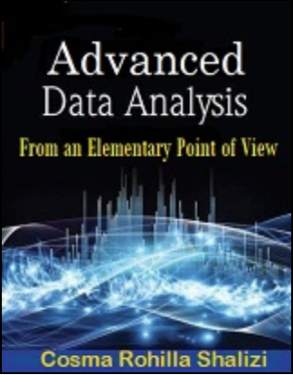](https://www.stat.cmu.edu/~cshalizi/ADAfaEPoV/)
  - **Author**: Cosma Shalizi (CMU)
  - **Year**: 2021
 
- [Causal Inference for the Brave and True](https://matheusfacure.github.io/python-causality-handbook/landing-page.html)
  - **Author**: Matheus Facure (Nubank)
  - **Year**: regularly updated

- [Causal Inference: The Mixtape 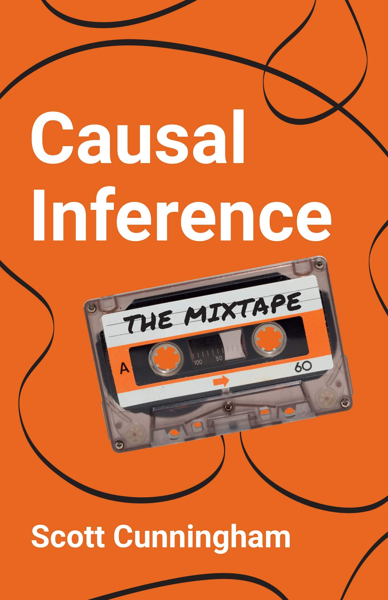](https://mixtape.scunning.com/)
    - **Author**: Scott Cunningham (Baylor University)
    - **Year**: 2021

- [The Effect 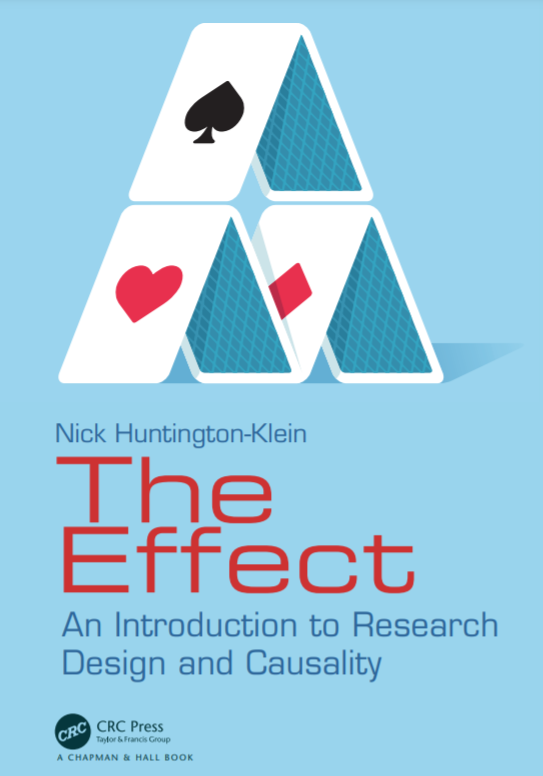](https://theeffectbook.net/)
  - **Author**: Nick C. Huntington-Klein (Seattle University) [[YouTube](https://www.youtube.com/playlist?list=PLcTBLulJV_AK1hKtnO0-kYrU0D09K-kj8)]
  - **Year**: 2021

- [Causal Inference: What If ](https://www.hsph.harvard.edu/miguel-hernan/causal-inference-book/)
  - **Author**: Miguel Hernan (Harvard University)
  - **Year**: 2020

## Paid

- [Causal Inference in Python ](https://www.oreilly.com/library/view/causal-inference-in/9781098140243/)
  - **Author**: Matheus Facure
  - **Year**: 2023

- [Causal Analysis ](https://mitpress.mit.edu/9780262545914/causal-analysis/)
  - **Author**:  Martin Huber (University of Fribourg)
  - **Year**: 2023

- [Causal Inference and Discovery in Python 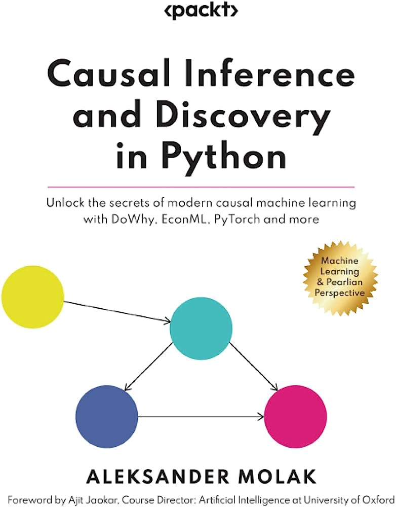](https://www.packtpub.com/product/causal-inference-and-discovery-in-python/9781804612989)
  - **Author**: Aleksander Molak
  - **Year**: 2023
 
- [Quasi-Experimentation: A Guide to Design and Analysis ](https://www.guilford.com/books/Quasi-Experimentation/Charles-Reichardt/9781462540204)
  - **Author**: Charles S. Reichardt
  - **Year**: 2019
 
- [Impact Evaluation: Treatment Effects and Causal Analysis 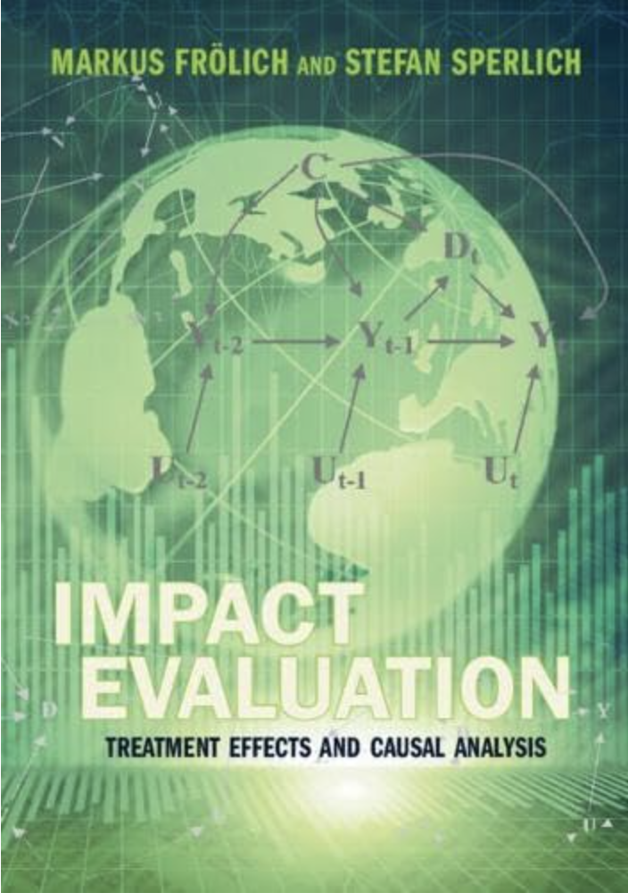](https://www.cambridge.org/ch/universitypress/subjects/economics/econometrics-statistics-and-mathematical-economics/impact-evaluation-treatment-effects-and-causal-analysis?format=AR&isbn=9781108617772)
  - **Author**: Markus Frölich, Stefan Sperlich
  - **Year**: 2019
 
- [Handbook of Graphical Models ](https://www.routledge.com/Handbook-of-Graphical-Models/Maathuis-Drton-Lauritzen-Wainwright/p/book/9780367732608)
  - **Author**: Marloes Maathuis, Mathias Drton, Steffen Lauritzen, Martin Wainwright
  - **Year**: 2019
 
- [The Book of Why ](http://bayes.cs.ucla.edu/WHY/)
  - **Author**: J. Pearl, D. Mackenzie
  - **Year**: 2018

- [Targeted Learning in Data Science - Causal Inference for Complex Longitudinal Studies ](https://link.springer.com/book/10.1007/978-3-319-65304-4)
  - **Author**: Mark J. van der Laan, Sherri Rose
  - **Year**: 2018

- [Elements of Causal Inference: Foundations and Learning Algorithms 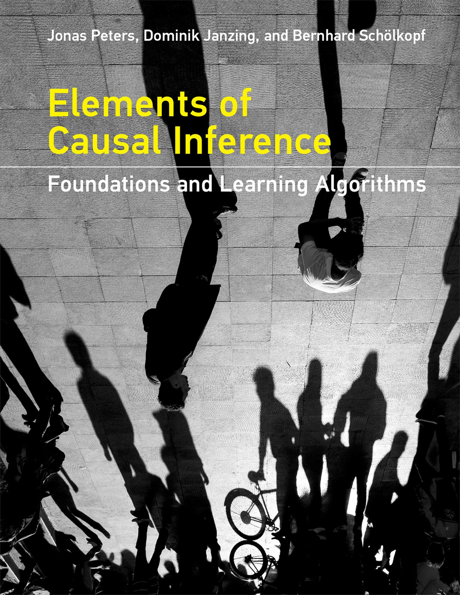](https://mitpress.mit.edu/9780262037310/elements-of-causal-inference/)
  - **Author**: Jonas Peters, Dominik Janzing, Bernhard Schölkopf
  - **Year**: 2017

- [Statistical Causal Inferences and Their Applications in Public Health Research ](https://link.springer.com/chapter/10.1007/978-3-319-41259-7_8)
  - **Author**: multiple
  - **Year**: 2016

- [Causal Inference in Statistics: A Primer 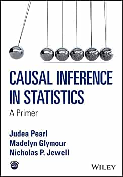](https://www.wiley.com/en-us/Causal+Inference+in+Statistics%3A+A+Primer-p-9781119186847)
  - **Author**: Judea Pearl, Madelyn Glymour, Nicholas P. Jewell
  - **Year**: 2016

- [Causal Inference for Statistics, Social, and Biomedical Sciences ](https://www.cambridge.org/core/books/causal-inference-for-statistics-social-and-biomedical-sciences/71126BE90C58F1A431FE9B2DD07938AB)
  - **Author**: Guido W. Imbens (Stanford University), Donald B. Rubin (Harvard University)
  - **Year**: 2015

- [Counterfactuals and Causal Inference ](https://www.cambridge.org/core/books/counterfactuals-and-causal-inference/5CC81E6DF63C5E5A8B88F79D45E1D1B7)
  - **Author**: Stephen L. Morgan (Johns Hopkins University), Christopher Winship (Harvard University)
  - **Year**: 2014

- [Statistical Methods for Dynamic Treatment Regimes 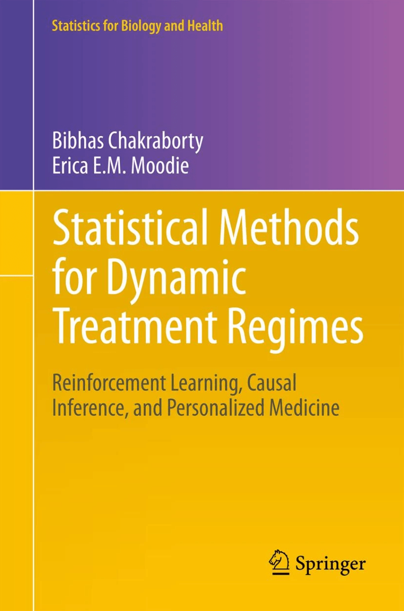](https://link.springer.com/book/10.1007/978-94-007-6094-37)
  - **Author**: Bibhas Chakraborty (Columbia University), Erica E.M. Moodie (McGill University)
  - **Year**: 2013

- [Handbook of Causal Analysis for Social Research 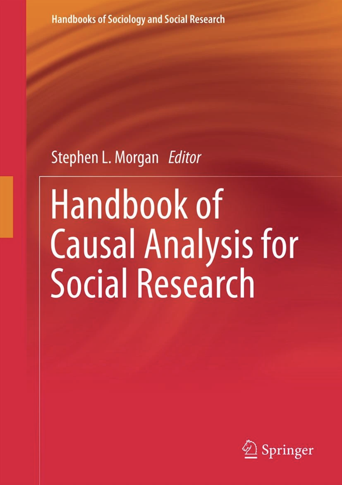](https://link.springer.com/book/10.1007/978-94-007-6094-37)
  - **Author**: Stephen L. Morgan (Johns Hopkins University)
  - **Year**: 2013

- [Targeted Learning - Causal Inference for Observational and Experimental Data 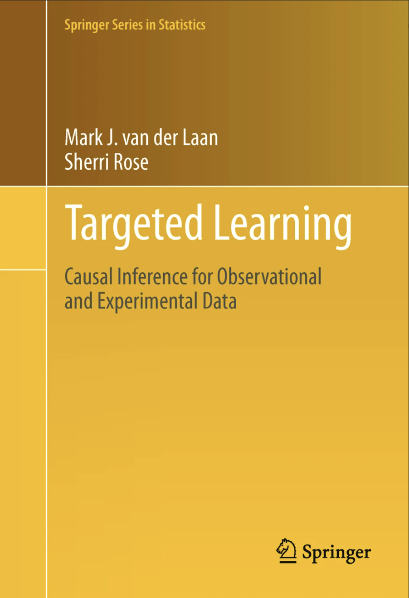](https://link.springer.com/book/10.1007/978-1-4419-9782-1)
  - **Author**: Mark J. van der Laan, Sherri Rose
  - **Year**: 2011

- [Design of Observational Studies ](https://link.springer.com/book/10.1007/978-1-4419-1213-8)
  - **Author**: Paul R. Rosenbaum
  - **Year**: 2010 

- [Mostly Harmless Econometrics: An Empiricist's Companion 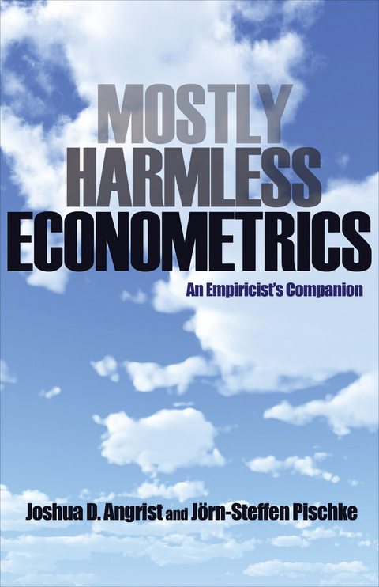](https://press.princeton.edu/books/paperback/9780691120355/mostly-harmless-econometrics)
  - **Author**: Joshua D. Angrist, Jörn-Steffen Pischke
  - **Year**: 2009

- [Causality ](https://www.cambridge.org/core/books/causality/B0046844FAE10CBF274D4ACBDAEB5F5B)
  - **Author**: Judea Pearl (University of California, Los Angeles)
  - **Year**: 2009

- [Unified Methods for Censored Longitudinal Data and Causality 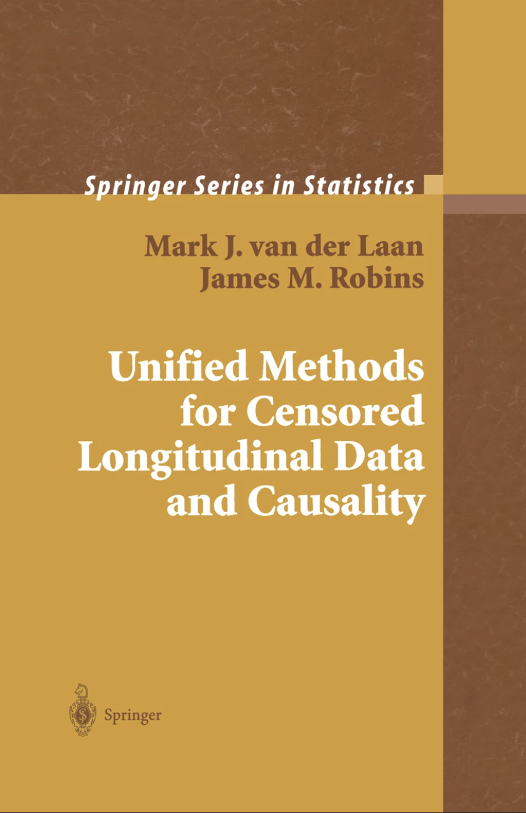](https://link.springer.com/book/10.1007/978-0-387-21700-0)
  - **Authors**: Mark J. van der Laan, James M. Robins   
  - **Year**: 2003

