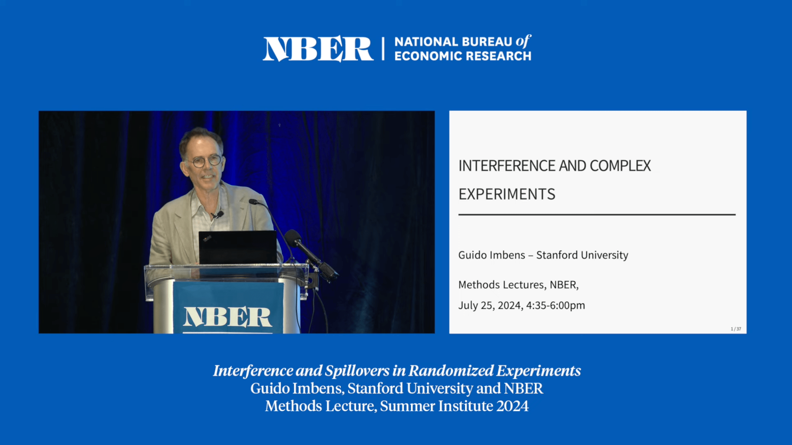
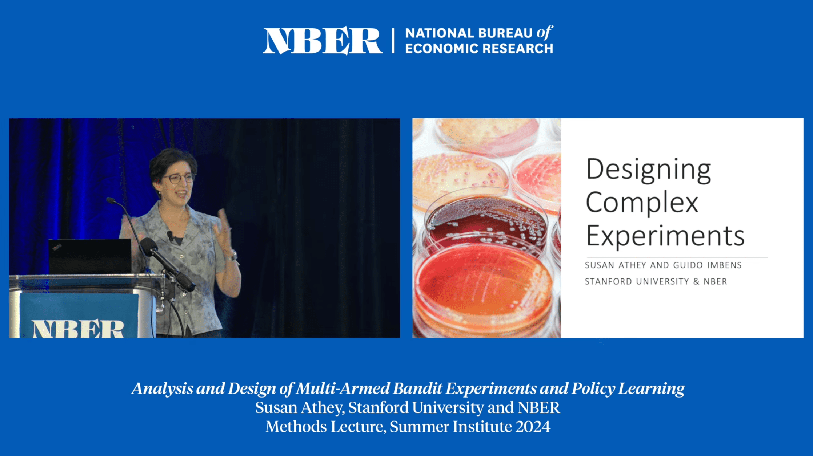
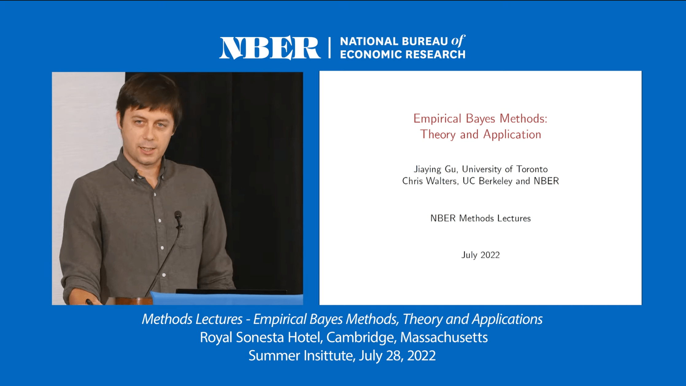
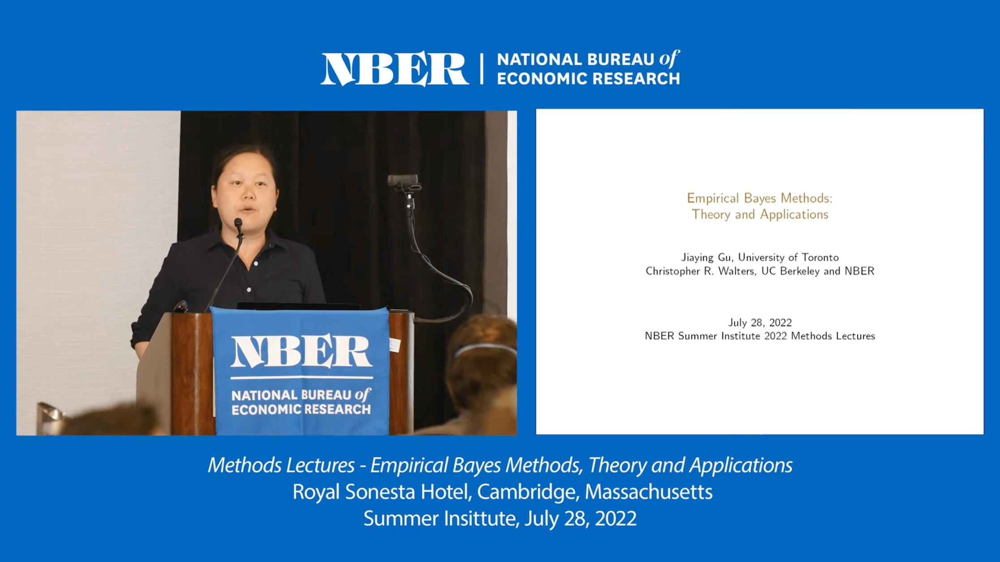
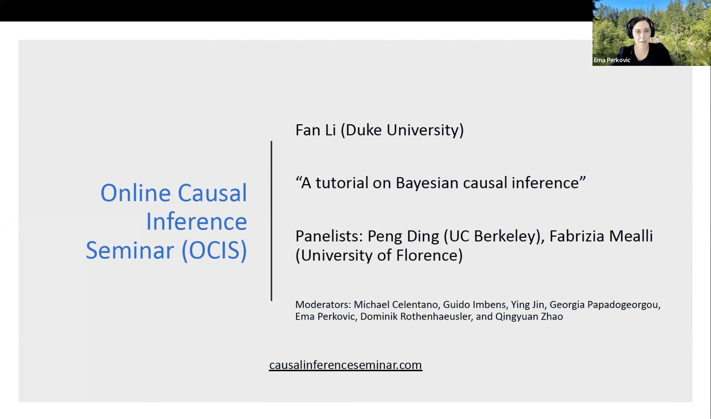
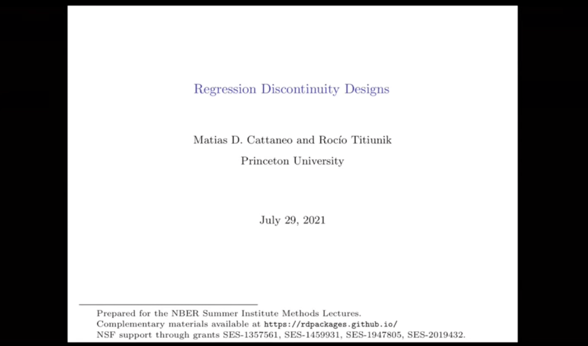
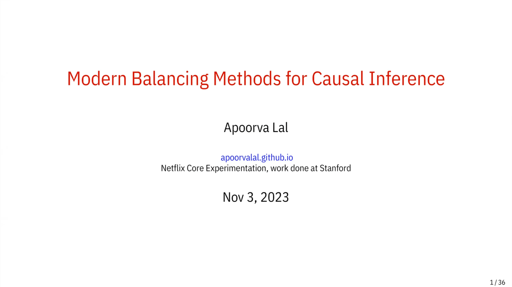

# Causal Inference Lectures

The following is a list of causal inference talks.

- [Academic](#academic)

- [Industry](#industry)

## Academic

- [Interference and Spillovers in Randomized Experiments ](https://www.youtube.com/watch?v=i5kyzT_CpwQ)
  - **Author**: Guido Imbens (Stanford University)
  - **Year**: 2024
  - **Event**: NBER Summer Institute
 
- [Analysis and Design of Multi-Armed Bandit Experiments and Policy Learning ](https://www.youtube.com/watch?v=I6GyDWh8kfw)
  - **Author**: Susan Athey (Stanford University)
  - **Year**: 2024
  - **Event**: NBER Summer Institute

- [Empirical Bayes Applications ](https://www.youtube.com/watch?v=SdWt8xAAF_4)
  - **Author**: Christopher Walters (University of California, Berkeley)
  - **Year**: 2022
  - **Event**: NBER Summer Institute
 
- [Empirical Bayes Theory ](https://www.youtube.com/watch?v=z0cdgtcWs0c)
  - **Author**: Jiaying Gu (University of Toronto)
  - **Year**: 2022
  - **Event**: NBER Summer Institute

- [A Tutorial on Bayesian Causal Inference ](https://www.youtube.com/watch?v=9pZtsVA6o4o)
  - **Author**: Fan Li (Duke University)
  - **Year**: 2022
  - **Event**: Online Causal Inference Seminar

- [Synthetic Controls: Methods and Practice ](https://www.youtube.com/watch?v=oDNaOpNK6G4)
  - **Author**: Alberto Abadie (MIT)
  - **Year**: 2021
  - **Event**: Online Causal Inference Seminar

- [Regression Discontinuity Designs: Practice and Topics ](https://www.youtube.com/watch?v=bFNUeTXOnQ4) - (2021)
  - **Author**: Matias Cattaneo (Princeton University)
  - **Year**: 2021
  - **Event**: Online Causal Inference Seminar

## Industry

- [Modern Balancing Methods for Causal Inference ](https://www.youtube.com/watch?v=CO9VnGy3esI)
  - **Author**: Apoorva Lal (Netflix)
  - **Year**: 2023
  - **Event**: Online Causal Inference Seminar

- [An Industry Perspective on Bandit Feedback](https://www.youtube.com/watch?v=NkVWwZKdMac) - Booking, Sharechat, Amazon, Spotify, Netflix (2023)

- [Causal Models in Practice at Lyft](https://twimlai.com/podcast/twimlai/causal-models-practice-lyft-sean-taylor/) - Lyft (2021)

- [A/B Testing at Zalando: Concepts and Tools](https://www.youtube.com/watch?v=wmEAUfkLk50) - Zalando (2021)

- [Always Valid Inference: Continuous Monitoring of A/B Test](https://www.youtube.com/watch?v=BanBrr3Hzm8) - Optimizely (2016)

